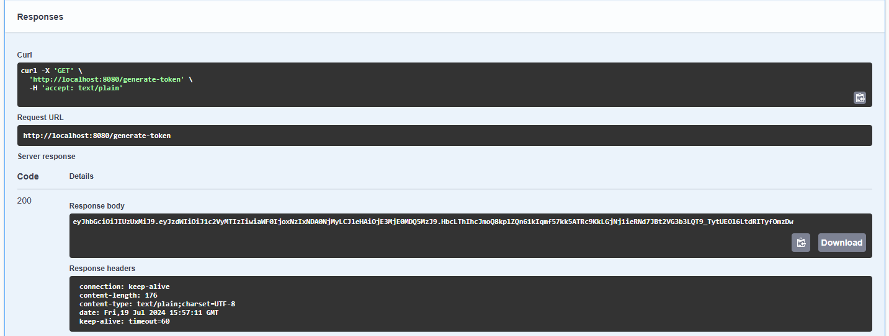
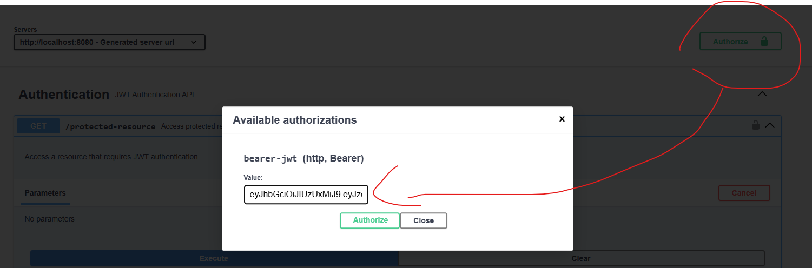
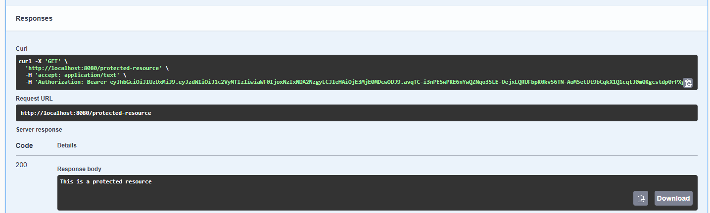

#  Customize Annotation

平常很常使用 Spring boot 提供給我們的 Annotation，實在是有夠方便。
如果也可以自己做一些 Annotation，就可以幫我做完一堆事情，感覺就很潮!
那到底該怎麼做呢?

## 情境

這邊我用 JWT 當作一個情境，
當我以下兩隻 API，

```java
@GetMapping("/generate-token")
public String generateToken() {
    return jwtUtil.generateToken("user123");
}

@GetMapping("/protected-resource")
public String protectedResource() {
    return "This is a protected resource";
}
```

而我想要產生一個 token 時，我希望不要驗證我有沒有 token (啊我就要產生，你還要驗證我幹嘛!!)，
而當我要存取 protected-resource 時，我希望我有 token 才能存取。

那麼這兩隻的 API 需求就不一樣，
如果我使用 OncePerRequestFilter 來做的話，那麼所有的 Request 都會被抓去驗證。
有沒有辦法達成我的需求?
在我需要被驗證的 API 上面加上一個 Annotation，而不需要被驗證的 API 不用加。

## 測試專案

1. 先把我的 [專案](https://github.com/mister33221/customize-annotation-practice.git) clone 下來。
直接給他跑起來!

2. 然後在瀏覽器出入 `http://localhost:8080/swagger-ui.html` 來開啟我們的 Swagger UI。

3. 第一步直接點擊 `protected-resource` 這個 API，會發現我們沒有 token，所以會被拒絕存取。

4. 那我們就來使用 `generate-token` 產生一個 token，

5. 把這個 token 複製下來，然後到右上角，會看到一個 `Authorize` 的按鈕，點進去之後，把 token 貼上去，然後按下 `Authorize`。
這樣我們就會在接下來的 Request 的 Header 裡面帶上一個叫做 `Authorization` 的 Header，裡面的值就是我們剛剛貼上去的 token。

6. 接著我們就可以使用 `protected-resource` 來存取我們的資源。


## 實作

其實我在每一個 class 裡面都已經寫了非常詳細該怎麼自己製作 Annotation，所以 README 裡面我就不寫得太詳細囉!

我甚至也順便把 OpenApi Swagger 的也寫了!

有興趣的就自己點開看看吧!
